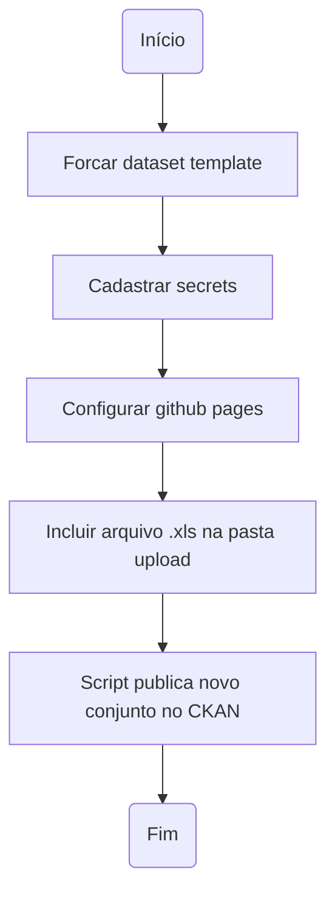

# Conjunto de dados - Dataset

Este dataset template é um conjunto de automatizações desenvolvidas pela Diretoria Central de Transparência Ativa - DCTA/CGE para criação, documentação, validação e publicação (criação e atualização em instâncias do CKAN) de conjunto de dados ou datasets.

Para esclarecimento sobre o fluxo completo de abertura de dados, favor consultar o [Manual do Portal de Dados Abertos de Minas Gerais](https://transparencia-mg.github.io/manual-dados-mg).

### Funcionalidades:

- Documentação de acordo com especificação de qualidade de metadados sem fricção ([fricitonless](https://specs.frictionlessdata.io/#overview)).
- Controle de versões da documentação e dos dados via Git e GitHub.
- Conversão automatizada de base de dados em Excel para formato tabular aberto (csv), caso necessário.
- Validação automatizada dos metadados e dos dados do conjunto, com demonstração de erros de validação, caso haja.
- Publicação automatizada (criação e atualização em instâncias do CKAN) do conjunto criado, documentado e validado.

### Como participar

A configuração deste dataset template está sendo feita de forma aberta e colaborativa no [GitHub](https://github.com/transparencia-mg/new-dataset-template).
Existem duas alternativas para enviar sua contribuição:

- [Issues](https://github.com/transparencia-mg/new-dataset-template/issues): Para iniciar uma discussão sobre melhorias de funcionalidades.
- [Pull requests](https://github.com/transparencia-mg/new-dataset-template/pulls): Para sugerir uma alteração concreta na ferramenta.

Todas as contribuições são bem vindas. Alguns exemplos são:

* Indicação de expressões imprecisas presentes na documentação;
* Sugestões para inclusão de descrições em campos específicos;
* Sugestões para clareza na organização das ideias;
* Correção de erros de ortografia e gramática.

### Fluxo de execução

### Setup do projeto

- **Todas as etapas de preparação da base de dados a ser publicada deverão estar finalizadas[^1] para realização dos passos descritos a seguir**.

- **Realize o fork do projeto** (utilizaremos um fork para conseguir atualizar as automatizações com maior facilidade no futuro):

- Selecione a organização a qual o novo conjunto de dados será criado e preencha o nome do novo repositório (**o nome deverá ser o mesmo do conjunto que será criado na instância do CKAN**).

  OBS.: Certifique-se que o nome desejado para o novo conjunto não está sendo usando, pela lista dos conjuntos atualmente publicados [em ambiente de produção](https://dados.mg.gov.br/api/3/action/package_list) e [homologação](https://homologa.cge.mg.gov.br/api/3/action/package_list) ou pelas respectivas páginas dos conjuntos publicados: [produção](https://dados.mg.gov.br/dataset/) e [homologação](https://homologa.cge.mg.gov.br/dataset/) 
   

- **Cadastre Secrets para publicação em instância CKAN**:

- **Deverão ser criadas três secrets**:
    - OWNER_ORG: Organização dentro da instância do CKAN desejada a qual o conjunto de dados será vinculado (nome disponível na url CKAN após `https://ckan-instance/organization/`), exemplos
      - `controladoria-geral-do-estado-cge` em https://dados.mg.gov.br/organization/controladoria-geral-do-estado-cge
      - `secretaria-de-estado-de-planejamento-e-gestao-seplag` em https://homologa.cge.mg.gov.br/organization/secretaria-de-estado-de-planejamento-e-gestao-seplag.
  
  OBS.: Certifique-se também de que seu usuário está cadastrado para a organização que deseja cadastrar o novo conjunto de dados, seja em [produção](https://dados.mg.gov.br/dashboard/organizations) em [homologação](https://homologa.cge.mg.gov.br/dashboard/organizations)
         
    - CKAN_HOST: Instância CKAN desejada, exemplo: `https://homologa.cge.mg.gov.br`
    - CKAN_KEY_USUARIOGITHUB: se meu usuário GitHub é `gabrielbdornas` este secret será `CKAN_KEY_GABRIELBDORNAS`. Para o `andrelamor`, o secret `CKAN_KEY_ANDRELAMOR`
      
        - **Necessário criar um novo API Token na instância CKAN desejada (copiar e colar o valor `API TOKEN created` da 4ª tela printada a seguir)**:

- Cadastrar GitHub pages para mostrar relatório de validação:

- Configurar permissão para Actions ler e escrever no repositório:

  OBS.: Caso a permissão para Actions ler e escrever no repositório não esteja habilitada, esta configuração deverá ser feita também no nível da organização.

- Para rodar o processo automatizado basta incluir base de dados a ser aberta na pasta `upload`, dentro da pasta `dataset` do novo repositório forkado e configurado:

[^1]: [Ciclo de Abertura, Documentação, Validação e Publicação](https://transparencia-mg.github.io/manual-dados-mg/0.1/2.%20Ciclo%20de%20publica%C3%A7%C3%A3o%20de%20dados/006_etapas_abertura/).
