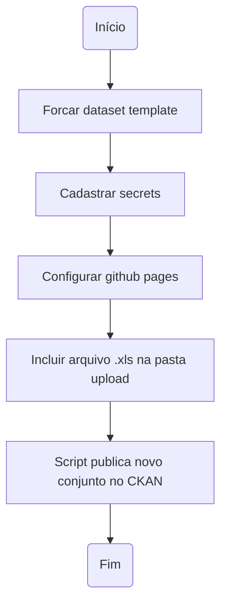

# Conjunto de dados - Dataset template

Este dataset template é um conjunto de automatizações desenvolvidas pela Diretoria Central de Transparência Ativa - DCTA/CGE para criação, documentação, validação e publicação (criação e atualização em instâncias do CKAN) de conjunto de dados ou datasets.

- Para esclarecimento sobre o fluxo completo de abertura de dados, favor consultar o [Manual do Portal de Dados Abertos de Minas Gerais](https://transparencia-mg.github.io/manual-dados-mg).
- Para criação de usuários nas ferramentas utilizadas na publicação de dados, favor consultar [Criação de usuário](https://github.com/transparencia-mg/handbook/blob/main/docs/posts/20230920_criacao_usuario_git_dadosmg.md)

### Funcionalidades:

- Documentação de acordo com especificação de qualidade de metadados sem fricção ([fricitonless](https://specs.frictionlessdata.io/#overview)).
- Controle de versões da documentação e dos dados via Git e GitHub.
- Conversão automatizada de base de dados em Excel para formato tabular aberto (csv), caso necessário.
- Validação automatizada dos metadados e dos dados do conjunto, com demonstração de erros de validação, caso haja.
- Publicação automatizada (criação e atualização em instâncias do CKAN) do conjunto criado, documentado e validado.
- Arquivo de configuração `scripts/config.py` para cadastro de abas a serem convertidas para `csv` dentro de arquivos Excel.

### Como participar

A configuração deste dataset template está sendo feita de forma aberta e colaborativa no [GitHub](https://github.com/transparencia-mg/new-dataset-template).
Existem duas alternativas para enviar sua contribuição:

- [Issues](https://github.com/transparencia-mg/new-dataset-template/issues): Para iniciar uma discussão sobre melhorias de funcionalidades.
- [Pull requests](https://github.com/transparencia-mg/new-dataset-template/pulls): Para sugerir uma alteração concreta na ferramenta.

Todas as contribuições são bem vindas. Alguns exemplos são:

* Indicação de expressões imprecisas presentes na documentação;
* Sugestões para inclusão de descrições em campos específicos;
* Sugestões para clareza na organização das ideias;
* Correção de erros de ortografia e gramática.

## Fluxo de execução

## Setup do projeto

Acesse aqui e veja o passo a passo da elaboração e publicação dos dados [Setup do Projeto](https://github.com/transparencia-mg/new-dataset-template/blob/main/Setup%20do%20projeto.md)
