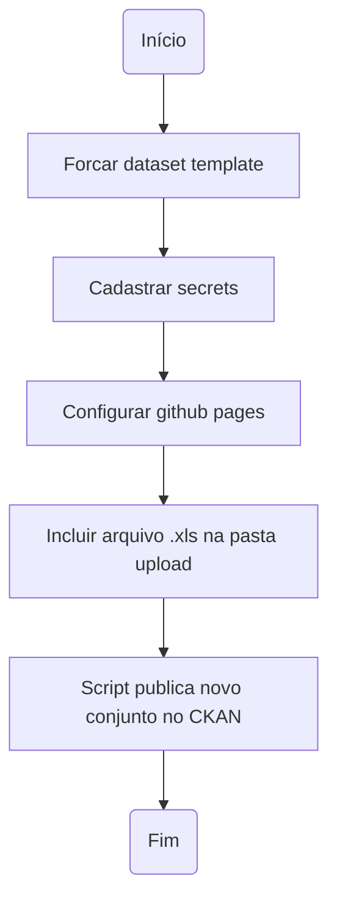

# Conjunto de dados - Dataset template

Este dataset template é um conjunto de automatizações desenvolvidas pela Diretoria Central de Transparência Ativa - DCTA/CGE para criação, documentação, validação e publicação (criação e atualização em instâncias do CKAN) de conjunto de dados ou datasets.

- Para esclarecimento sobre o fluxo completo de abertura de dados, favor consultar o [Manual do Portal de Dados Abertos de Minas Gerais](https://transparencia-mg.github.io/manual-dados-mg).
- Para criação de usuários nas ferramentas utilizadas na publicação de dados, favor consultar [Criação de usuário](https://github.com/transparencia-mg/handbook/blob/main/docs/posts/20230920_criacao_usuario_git_dadosmg.md)

### Funcionalidades:

- Documentação de acordo com especificação de qualidade de metadados sem fricção ([fricitonless](https://specs.frictionlessdata.io/#overview)).
- Controle de versões da documentação e dos dados via Git e GitHub.
- Conversão automatizada de base de dados em Excel para formato tabular aberto (csv), caso necessário.
- Validação automatizada dos metadados e dos dados do conjunto, com demonstração de erros de validação, caso haja.
- Publicação automatizada (criação e atualização em instâncias do CKAN) do conjunto criado, documentado e validado.
- Arquivo de configuração `scripts/config.py` para cadastro de abas a serem convertidas para `csv` dentro de arquivos Excel.

### Como participar

A configuração deste dataset template está sendo feita de forma aberta e colaborativa no [GitHub](https://github.com/transparencia-mg/new-dataset-template).
Existem duas alternativas para enviar sua contribuição:

- [Issues](https://github.com/transparencia-mg/new-dataset-template/issues): Para iniciar uma discussão sobre melhorias de funcionalidades.
- [Pull requests](https://github.com/transparencia-mg/new-dataset-template/pulls): Para sugerir uma alteração concreta na ferramenta.

Todas as contribuições são bem vindas. Alguns exemplos são:

* Indicação de expressões imprecisas presentes na documentação;
* Sugestões para inclusão de descrições em campos específicos;
* Sugestões para clareza na organização das ideias;
* Correção de erros de ortografia e gramática.

## Fluxo de execução



## Setup do projeto

**Todas as etapas de preparação da base de dados a ser publicada e criação de usuários deverão estar finalizadas[^1] para realização dos passos descritos a seguir**.

### Fork do projeto

1- Realize o fork do projeto (utilizaremos um fork para conseguir atualizar as automatizações com maior facilidade no futuro):


2- Selecione a organização a qual o novo conjunto de dados será criado e preencha o nome do novo repositório (**o nome deverá ser o mesmo do conjunto que será criado na instância do CKAN**).


  OBS.: Certifique-se que o nome desejado para o novo conjunto não está sendo usando, pela lista dos conjuntos atualmente publicados [em ambiente de produção](https://dados.mg.gov.br/api/3/action/package_list) e [homologação](https://homologa.cge.mg.gov.br/api/3/action/package_list) ou pelas respectivas páginas dos conjuntos publicados: [produção](https://dados.mg.gov.br/dataset/) e [homologação](https://homologa.cge.mg.gov.br/dataset/)


### Cadastrar Secrets

1-. Para cadastrar a Secrets para publicação em instância CKAN seguir os passos abaixo:


2- Deverão ser criadas três secrets:

- OWNER_ORG: Organização dentro da instância do CKAN desejada a qual o conjunto de dados será vinculado (nome disponível na url CKAN após `https://ckan-instance/organization/`).<br>
  Exemplos:
  - `controladoria-geral-do-estado-cge` em https://dados.mg.gov.br/organization/controladoria-geral-do-estado-cge
  - `secretaria-de-estado-de-planejamento-e-gestao-seplag` em https://homologa.cge.mg.gov.br/organization/secretaria-de-estado-de-planejamento-e-gestao-seplag.

  OBS.: Certifique-se também de que seu usuário está cadastrado para a organização que deseja cadastrar o novo conjunto de dados, seja em [produção](https://dados.mg.gov.br/dashboard/organizations) em [homologação](https://homologa.cge.mg.gov.br/dashboard/organizations)

- CKAN_HOST: Instância CKAN desejada, exemplo: `https://homologa.cge.mg.gov.br`
- CKAN_KEY_USUARIOGITHUB: se meu usuário GitHub é `gabrielbdornas` este secret será `CKAN_KEY_GABRIELBDORNAS`. Para o `andrelamor`, o secret `CKAN_KEY_ANDRELAMOR`

    - Para completar o cadastro na instância CKAN_KEY é necessário criar um novo API Token (copiar e colar o valor `API TOKEN created`):


  - Copiar e colar esse valores `API TOKEN created`


### Configurar permissão para Actions ler e escrever no repositório:

Caso a permissão para Actions ler e escrever no repositório não esteja habilitada, esta configuração deverá ser feita também no nível da organização.


### ACTIONS:

Após finalizar os passos acima, clicar em Actions e selecionar o botão verde " I understand my workflows, go ahead and enable them"


### Incluir arquivo para publicação:

Para rodar o processo automatizado é necessária a inclusão do arquivo .xlsx ou .xls na pasta de dados `upload` do novo repositório forkado e configurado.


Após incluir o arquivo o processo encontra-se concluído. Verifique se os dados foram corretamente publicados


## Atualizações de dados

### A partir do repositório template

1- Nos repositórios forkados do new-dataset-template, observar se há commits do repositório template para serem sincronizados:


2- Caso positivo, clique em `Sync fork`e, depois, no botão `update branch`:


3- Aparecerá a mensagem na tarja superior em azul-claro:


Observe que o repositório clonado na máquina precisará do `pull`, para ser atualizado após esse sync, como qualquer alteração que ocorre no github.

**Observação:**

Clicando em `Fork`, é possível listar todos os repositórios que foram gerados a partir do new-dataset-template, e conferir um por um:


### IMPORTANTE - Dos dados nos novos repositórios criados

Para alterar qualquer arquivo referente aos dados publicados é **necessário estar dentro da pasta `dataset` para os aquivos: (README, CHANGELOG, CONTRIBUTING,DATAPACKEGE.yaml) ou dentro da pasta `upload` para os arquivos excel xlsx.** As modificações automáticas só serão publicadas no CKAN se as alterações forem realizadas nestas pastas. 

**ATENÇÃO: NÃO ALTERAR/EDITAR DATAPACKEGE.json, apenas mexer no DATAPACKEGE.yaml.**

**ATENÇÃO: NÃO ALTERAR/EDITAR os arquivos da raiz do template.**:


#### Arquivo excel com mais de uma aba

Abas: caso mais de uma aba em um arquivo excel necessite ser convertida para CSV, basta descomentar o código no arquivo `config.py` e incluir o nome do arquivo (com a correta extensão) e sua(s) respectiva(s) aba(s) para conversão.
````
abas = {
#     'nome_do_arquivo.xlsx': [
#         'nome_da_aba1',
#         'nome_da_aba2',
#         'nome_da_aba3',
#     ],
````

[^1]: [Ciclo de Abertura, Documentação, Validação e Publicação](https://transparencia-mg.github.io/manual-dados-mg/0.1/2.%20Ciclo%20de%20publica%C3%A7%C3%A3o%20de%20dados/006_etapas_abertura/).
